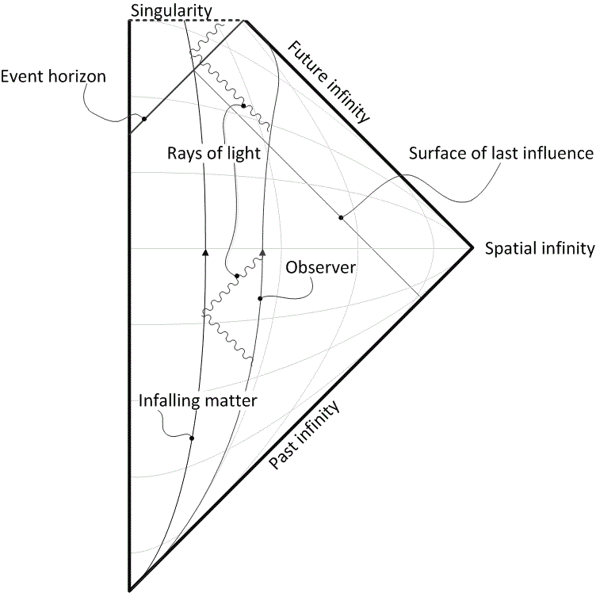

------------------

Gravitational waves (GW) travel throughout the Universe, unimpeded. They are around us all the time, carrying information about the sources that generate them. When these sources are very compact and massive (think: black holes and neutron stars) the GWs are loud enough to be detected on Earth with dedicated machines.

Since the first detection of the GWs from a coalescing binary formed of two black holes, back in 2015, the field of gravitational-wave astronomy has exploded. While we are already basking in the "bright" of hundreds of events, it is expected that future detectors will reveal thousands upon thousands more. This ever-increasing dataset is, and will continue to be a trove of astrophysical and cosmological information.

To maximise the scientific return of current as well as future detectors, GW astrophysicists need to work on three broad (and interacting) fronts: the **theory of gravity**, **astrophysics**, and **statistical analyses**.

------------------

>Unsurprisingly, the **theory of gravity** needs to be studied in excruciating detail. Within certain schemes, solutions to the general-relativistic equations of motions can be obtained. This is the bedrock to develop waveform predictions, themselves the pillars of GW *source modelling*. This theme also includes studying potential *modifications* to the underlying theories of gravity (because you never know!) and their effects on cosmology or the spacetime of compact objects. 

[My contributions](https://inspirehep.net/authors/1755036?ui-citation-summary=true){: .btn--research}

------------------

>The **astrophysics** of black holes also needs to be studied, to understand what we may expect to find in detectors' data. This area may include understanding the formation scenarios of black holes and neutron stars,  the populations of galactic binaries in the Milky Way, the environments of the gargantuan supermassive black holes at the centre of most galaxies, and many more. 

[My contributions](https://inspirehep.net/authors/1755036?ui-citation-summary=true){: .btn--research}

------------------

>Finally, **statistics** is the language used to interpret the data coming out of detectors and unlock the Science described above. Statistical analyses need to be absolutely on point to avoid misinterpreting data and inferring the wrong science. 

[My contributions](https://inspirehep.net/authors/1755036?ui-citation-summary=true){: .btn--research}

------------------

In my work, I try to connect some of the dots between gravity, astrophysics and statistical analyses. In any given day I may find myself modelling waveforms, discussing the astrophysics of GW sources, or trying to come up with robust statistical techniques. Most likely, though, a combination of the three.